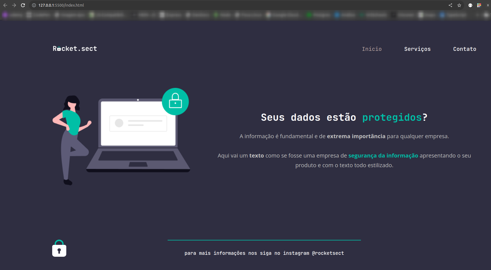

# Projeto PadLock

Resolução desafio de recriar um layout.

Página fictícia de uma empresa de segurança da informação. Possui uma área de navegação e alguns parágrafos para explicar o que a empresa desenvolve.

Layout:

  

Esse projeto foi desenvolvido com as seguintes tecnologias:

- HTML e CSS
- Git e Github
- Figma

Obs: HTML validado no site da W3.

